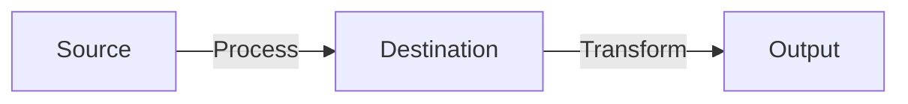
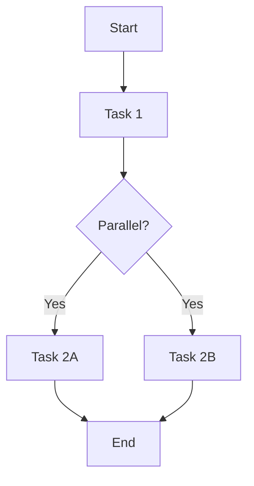
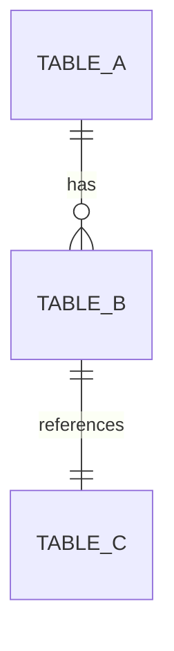
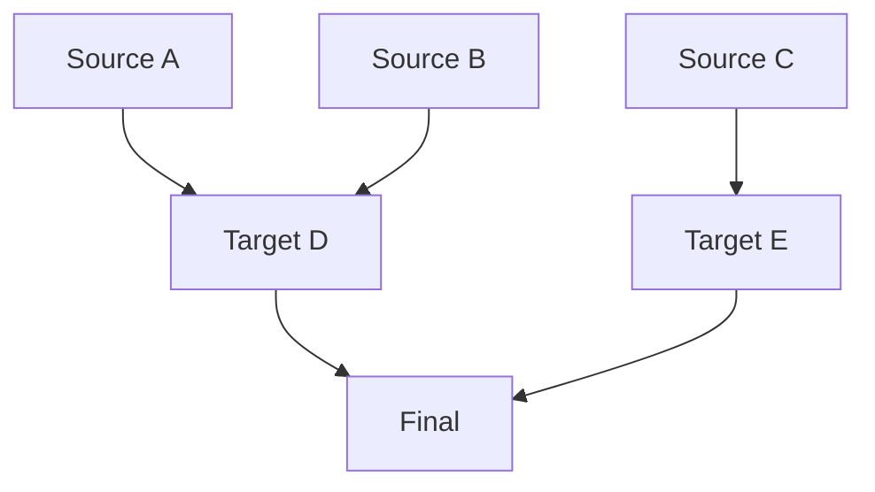

# APS Documentation Core

Core documentation generation framework providing shared patterns, templates, and utilities used by all APS layer-specific documentation skills (ingestion, hist-union, staging, id-unification, golden).

## When to Use This Skill

Use this skill when:
- Creating custom documentation that doesn't fit standard layer types
- Understanding core documentation generation principles
- Extending layer-specific skills with new patterns
- Implementing custom documentation workflows

**Note:** For layer-specific documentation, use the specialized skills:
- `aps-doc-skills:ingestion` for ingestion layers
- `aps-doc-skills:hist-union` for hist-union workflows
- `aps-doc-skills:staging` for staging transformations
- `aps-doc-skills:id-unification` for ID unification
- `aps-doc-skills:golden` for golden layers

---

## 🚨 MANDATORY: Codebase Access Required

**WITHOUT codebase access = NO documentation. Period.**

**If no codebase access provided:**
```
I cannot create technical documentation without codebase access.

Required:
- Directory path to code
- Access to relevant files (.dig, .sql, .yml)

Without access, I cannot extract real configurations, SQL, or workflow logic.
Provide path: "Code is in /path/to/layer/"
```

**Before proceeding:**
1. Ask for codebase path if not provided
2. Verify files exist using Glob/Read
3. STOP if cannot read files

**All documentation MUST contain real data from codebase:**
- Actual table/database/column names
- Real file paths with line numbers
- Working code examples from actual files
- Extracted configurations, not placeholders

**NO generic templates. Only production-ready, codebase-driven documentation.**

---

## Core Principles

### 1. Template-Based Documentation

All documentation follows a template-driven approach:

**Process:**
1. User provides or references existing Confluence template
2. Skill analyzes template structure (sections, formatting, patterns)
3. Skill explores codebase to extract implementation details
4. Skill generates documentation matching template with actual data
5. Skill validates and publishes to Confluence

**Benefits:**
- Consistency across all documentation
- Reuses proven documentation structures
- Adapts to organization-specific templates

### 2. Three-Phase Documentation Workflow

#### Phase 1: Template Analysis
```yaml
1. Fetch existing Confluence page (if provided)
2. Extract structure:
   - Section headings hierarchy
   - Content organization patterns
   - Tables and formatting styles
   - Code block conventions
3. Identify required sections
4. Map sections to codebase elements
```

#### Phase 2: Codebase Exploration
```yaml
1. Locate relevant files:
   - Workflow files (.dig)
   - Configuration files (.yml)
   - SQL/transformation files (.sql)
   - README and documentation and others if any

2. Extract metadata:
   - Table schemas (columns, types, nullability)
   - Data lineage (source → destination)
   - Dependencies (what depends on what)
   - Configuration parameters

3. Analyze patterns:
   - Processing logic (incremental, full, batch)
   - Error handling strategies
   - Performance optimizations
   - Security patterns (PII, auth)
```

#### Phase 3: Documentation Generation
```yaml
1. Create outline matching template
2. Populate sections with codebase data:
   - Use actual file names and paths
   - Include real configuration examples
   - Show actual SQL transformations
   - Document real table/column names

3. Add visual elements:
   - Mermaid diagrams (flow, ERD, dependencies)
   - Tables (configuration, mappings, metrics)
   - Code blocks (with syntax highlighting)

4. Validate quality (60+ checks)
5. Test code examples (execute SQL, validate YAML)
6. Publish to Confluence
```

## Standard Documentation Template

Use this structure as the base template for all layer documentation:

```markdown
# {Layer Name}

## Overview

Brief introduction explaining purpose and key characteristics.

### Key Characteristics

* **Engine**: Processing engine (Presto/Trino, Hive, etc.)
* **Architecture**: Processing approach (loop-based, parallel, etc.)
* **Processing Mode**: Incremental/Full/Batch
* **Location**: File system path

---

## Architecture Overview

### Directory Structure

```
layer_directory/
├── main_workflow.dig
├── config/
│   └── configuration.yml
├── sql/ or queries/
│   └── transformation.sql
└── README.md
```

### Core Components

Detailed description of each component.

---

## Processing Flow

### Initial Load (if applicable)

Step-by-step description of first-time processing.

### Incremental Load

Step-by-step description of ongoing processing.

---

## Configuration

Complete configuration reference with examples.

---

## Monitoring and Troubleshooting

### Monitoring Queries

Executable SQL queries for checking status.

### Common Issues

Issue descriptions with solutions.

---

## Best Practices

Numbered list of recommendations.

---

## Summary

Key takeaways and benefits.
```

## Visual Diagram Generation

Generate Mermaid diagrams to visualize architecture:

### Data Flow Diagram


### Workflow Execution Graph


### Entity Relationship Diagram


### Dependency Tree


## Metadata Extraction Patterns

### Table Schema Documentation

Extract and document schemas:

```sql
-- Get schema
DESCRIBE {database}.{table};
SHOW COLUMNS FROM {database}.{table};
```

**Document in table format:**

| Column | Type | Nullable | Description | Source | Transformation |
|--------|------|----------|-------------|--------|----------------|
| id | BIGINT | NO | Primary key | source.id | CAST(id AS BIGINT) |
| email | VARCHAR | YES | Email address | source.email | LOWER(TRIM(email)) |

### Volume Metrics

```sql
SELECT
    '{table}' as table_name,
    COUNT(*) as total_rows,
    COUNT(DISTINCT primary_key) as unique_records,
    MIN(time) as earliest_record,
    MAX(time) as latest_record
FROM {database}.{table};
```

### Column-Level Lineage

```
column_name:
  Source: source_system.source_table.source_column
  → Raw: raw_db.raw_table.column (as-is)
  → Staging: stg_db.stg_table.column_std (UPPER(TRIM(column)))
  → Unified: unif_db.unif_table.column (from staging)
  → Golden: gld_db.gld_table.column (SCD Type 2)
```

## Quality Validation Framework

### 60+ Quality Checks

Before publishing, validate:

#### Content Accuracy (8 checks)
- [ ] All file paths exist
- [ ] All table names match database
- [ ] All column names exist in schemas
- [ ] Configuration examples are valid
- [ ] SQL queries are syntactically correct
- [ ] Database names are accurate
- [ ] Data types correctly documented
- [ ] Incremental fields verified

#### Functional Validation (7 checks)
- [ ] Monitoring queries execute successfully
- [ ] Example commands run without errors
- [ ] Configuration examples are copy-paste ready
- [ ] SQL transformations produce expected results
- [ ] Incremental logic correctly documented
- [ ] Deduplication logic verified
- [ ] Error handling documented and tested

#### Structure & Formatting (7 checks)
- [ ] Section headings match template
- [ ] Code blocks have syntax highlighting
- [ ] Tables properly formatted
- [ ] Links work correctly
- [ ] Mermaid diagrams render
- [ ] Collapsible sections work
- [ ] Table of contents complete

#### Completeness (8 checks)
- [ ] All required sections included
- [ ] Troubleshooting section complete
- [ ] Examples actionable and realistic
- [ ] All dependencies documented
- [ ] All parameters explained
- [ ] Performance considerations included
- [ ] Security aspects documented
- [ ] SLA/freshness requirements documented

#### Metadata Validation (6 checks)
- [ ] Table schemas included
- [ ] Data lineage diagram included
- [ ] Dependency graph complete
- [ ] Volume metrics documented
- [ ] Processing SLAs documented
- [ ] Data retention policies noted

#### User Experience (6 checks)
- [ ] Easy to navigate
- [ ] Technical terms explained
- [ ] Examples relevant
- [ ] Next steps clear
- [ ] Related documentation linked
- [ ] Contact information provided

## Documentation Testing Framework

### Test 1: Code Examples Validation

```sql
-- Test monitoring queries
SELECT * FROM {database}.{log_table}
WHERE source = '{source}'
ORDER BY time DESC
LIMIT 10;

-- Test schema queries
DESCRIBE {database}.{table};

-- Test volume queries
SELECT COUNT(*) FROM {database}.{table};
```

### Test 2: Configuration Validation

```bash
# Validate YAML syntax
python3 -c "import yaml; yaml.safe_load(open('config.yml'))"

# Check for placeholders
grep -r "your_\|example_\|placeholder" config.yml
```

### Test 3: Link Validation

- Extract all Confluence links
- Test each returns valid page
- Verify hierarchy correct
- Check cross-references

### Test 4: Diagram Rendering

- Extract Mermaid blocks
- Validate syntax
- Test rendering in Confluence
- Verify accuracy

### Test 5: Accuracy Verification

```sql
-- Verify table exists
SHOW TABLES IN {database} LIKE '{table}';

-- Verify columns exist
SELECT column_name FROM information_schema.columns
WHERE table_schema = '{database}'
  AND table_name = '{table}';
```

### Test 6: Completeness Check

- Compare with template structure
- Verify mandatory sections present
- Check layer-specific requirements
- Validate examples for each section

## Confluence Integration

### Creating Pages

```yaml
Tool: mcp__atlassian__createConfluencePage

Parameters:
  cloudId: "https://treasure-data.atlassian.net"
  spaceId: "{numeric space ID}"
  title: "Clear, descriptive title"
  body: "Complete Markdown content"
  parentId: "{parent page ID}" (optional, for hierarchy)
```

### Updating Pages

```yaml
Tool: mcp__atlassian__updateConfluencePage

Parameters:
  cloudId: "https://treasure-data.atlassian.net"
  pageId: "{existing page ID}"
  body: "Updated Markdown content"
  title: "New title" (optional)
  versionMessage: "Description of changes" (optional)
```

### Creating Child Pages

For complex layers with multiple components:

1. Create parent overview page
2. Create child pages for each component
3. Link from parent using Confluence URLs

```markdown
## Components

1. [**Component 1**](https://treasure-data.atlassian.net/wiki/spaces/.../pages/.../Component+1)
   - Description

2. [**Component 2**](https://treasure-data.atlassian.net/wiki/spaces/.../pages/.../Component+2)
   - Description
```

## Common Patterns

### Pattern 1: Multi-Component Documentation

For layers with multiple workflows/tables:

1. Create parent page with overview
2. List all components in summary table
3. Create child page per component
4. Link child pages from parent
5. Add cross-references between related components

### Pattern 2: Performance Metrics

Document performance characteristics:

| Metric | Value | Benchmark |
|--------|-------|-----------|
| Avg Processing Time | 15 min | < 30 min SLA |
| Peak Memory Usage | 8 GB | 12 GB limit |
| Avg Rows/Day | 2.5M | Growing 10% monthly |

### Pattern 3: Security Documentation

Document PII and compliance:

| Table | PII Columns | Protection | Retention | Access |
|-------|-------------|------------|-----------|--------|
| table_a | email, phone | SHA256 | 7 years | Restricted |
| table_b | ip_address | Anonymization | 90 days | Internal |

### Pattern 4: Version History

Track documentation changes:

| Version | Date | Changed By | Changes | Impact |
|---------|------|------------|---------|--------|
| v2.1 | 2025-11-27 | Claude | Added 3 tables | Low |
| v2.0 | 2025-11-15 | Team | Migrated engine | High |

## Troubleshooting

### Issue: Cannot Find Files

**Solutions:**
1. Verify directory path with `ls`
2. Search recursively with `find . -name "*.dig"`
3. Check git branch
4. Ask user for exact location

### Issue: Configuration Unclear

**Solutions:**
1. Read multiple example configs
2. Look for schema documentation
3. Analyze workflow references
4. Ask user for clarification

### Issue: Complex Transformations

**Solutions:**
1. Break down analysis by section
2. Document each CTE separately
3. Create transformation flow diagram
4. Extract column mapping matrix

### Issue: Template Mismatch

**Solutions:**
1. Confirm with user which template to follow
2. Identify adaptable sections
3. Get approval for deviations
4. Document why structure differs

## Best Practices

1. **Always read codebase first** - Never document based on assumptions
2. **Use actual examples** - No placeholders or generic values
3. **Validate everything** - Test SQL, validate YAML, check links
4. **Follow template exactly** - Match structure, headings, formatting
5. **Include visuals** - Diagrams make complex systems understandable
6. **Document security** - Always include PII and compliance details
7. **Test before publishing** - Run all 60+ quality checks
8. **Keep it actionable** - Every example should be copy-paste ready

## Resources

- **Atlassian MCP Documentation**: For Confluence integration
- **Digdag Documentation**: https://docs.digdag.io/ - For workflow syntax
- **Treasure Data Documentation**: https://docs.treasuredata.com/ - For TD patterns
- **Presto SQL Reference**: https://prestodb.io/docs/current/ - For SQL transformations

---

## Summary

The APS Documentation Core provides:

- ✅ **Template-based generation** for consistency
- ✅ **Three-phase workflow** (analyze, explore, generate)
- ✅ **Visual diagram generation** (4 Mermaid types)
- ✅ **Metadata extraction** (schemas, lineage, volumes)
- ✅ **Quality validation** (60+ checks)
- ✅ **Documentation testing** (6 test categories)
- ✅ **Confluence integration** (create, update, hierarchy)
- ✅ **Common patterns** (multi-component, performance, security)

This core framework is used by all layer-specific skills to ensure consistent, high-quality documentation across all Treasure Data pipeline layers.
